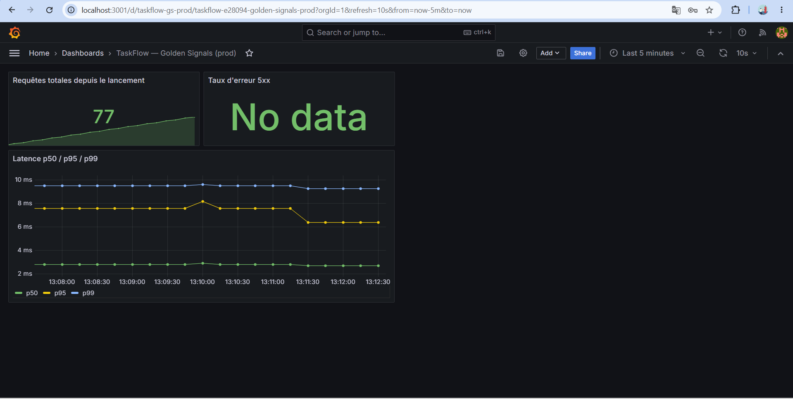
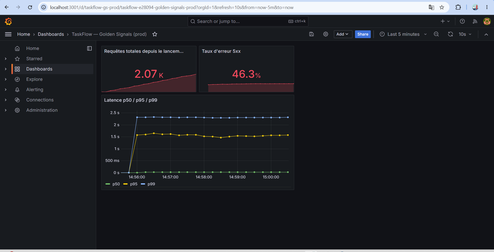
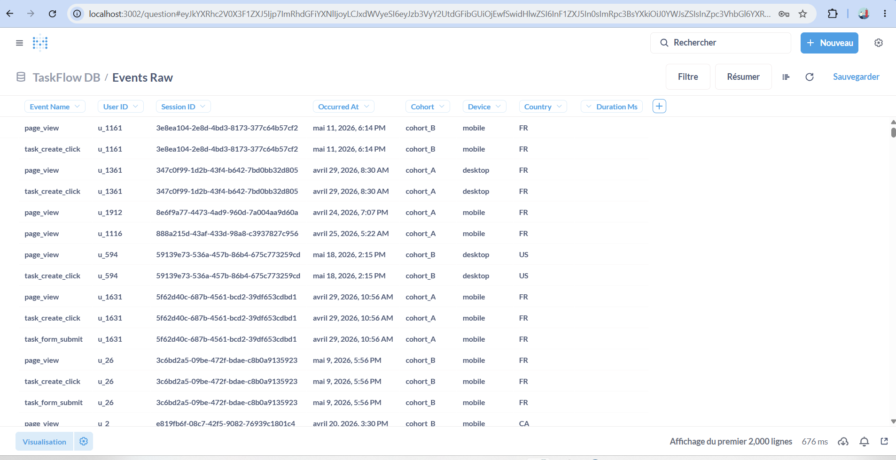
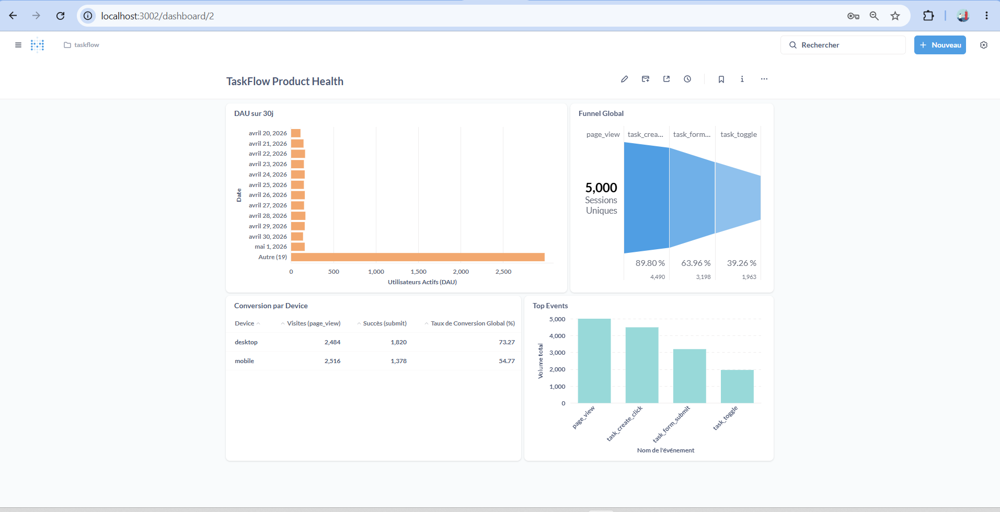
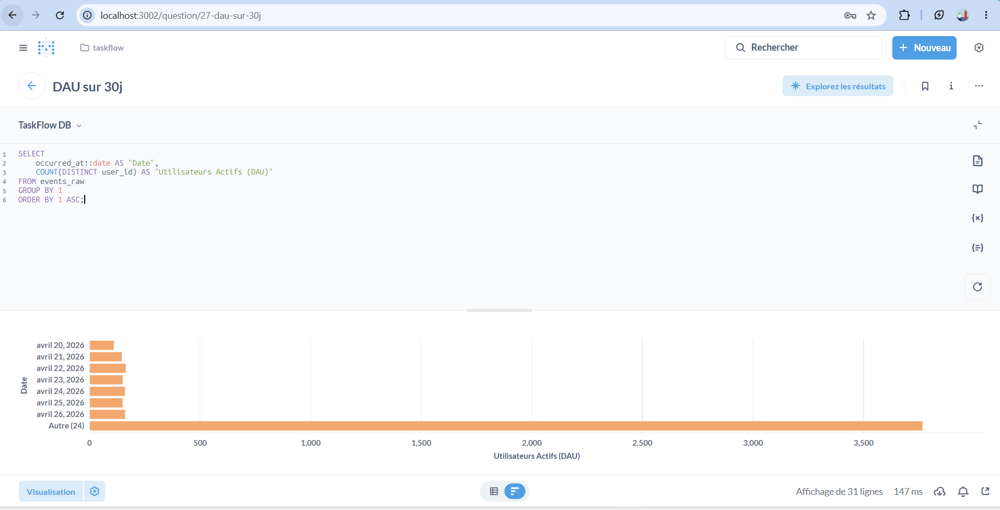
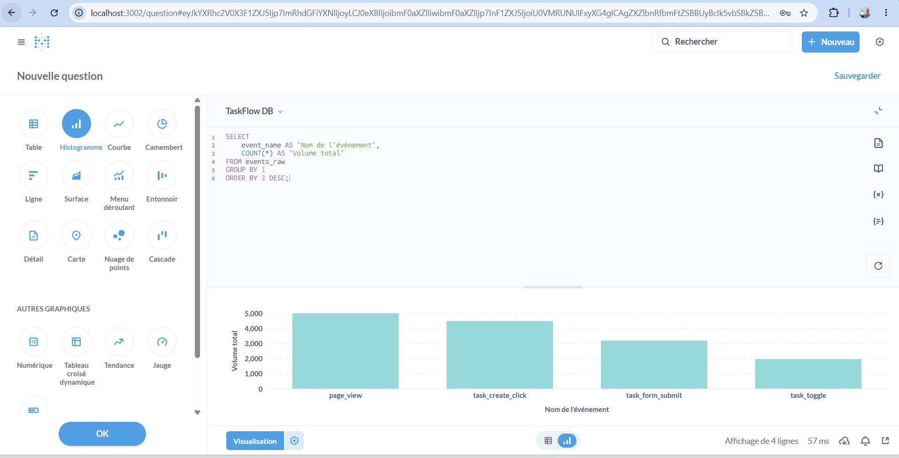
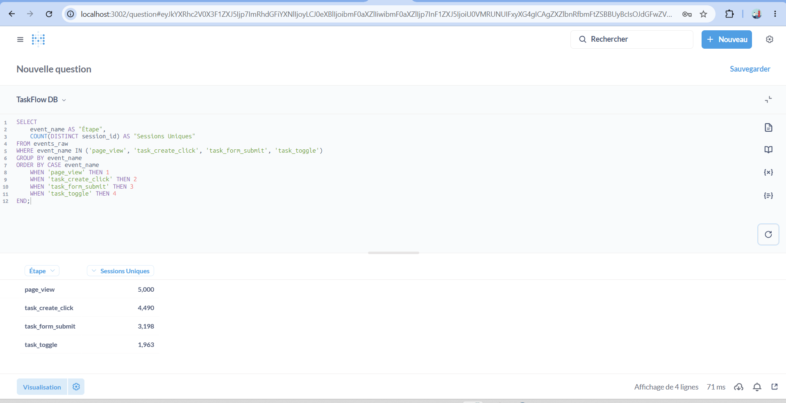
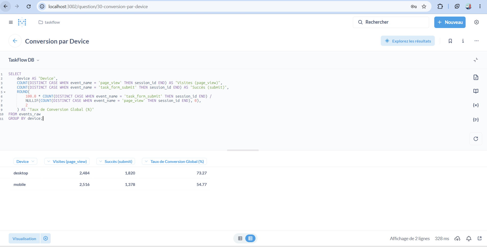
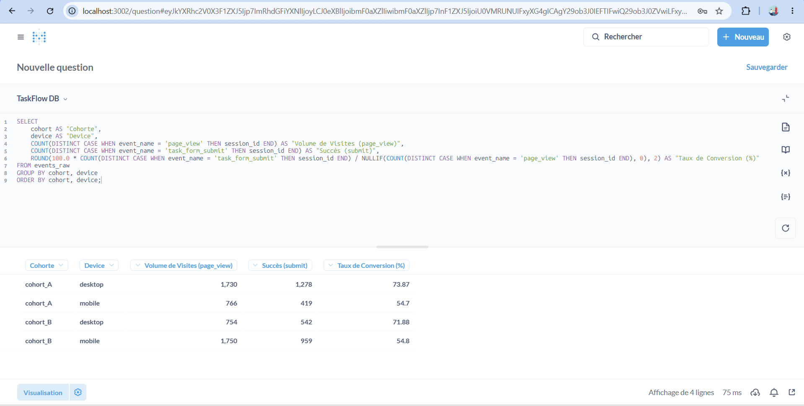

# Rapport de Louis Constant - ESGI M1 IW

## Partie 1 — Audit du code & Infrastructure

### Bug #1 : Explosion de cardinalité

* Description du problème : Dans backend/server.js, la métrique http_requests_total inclut un label nommé user_id. À chaque requête, la valeur de l'identifiant de l'utilisateur est injectée dans les étiquettes du compteur Prometheus.
* Conditions de manifestation : Ce bug se manifeste dès que l'application est déployée en production et reçoit du trafic de la part de milliers d'utilisateurs uniques.
* Impact concret : Prometheus crée une série temporelle unique en mémoire pour chaque combinaison distincte de labels. L'utilisation d'une donnée à forte cardinalité comme un ID utilisateur fait exploser le nombre de séries suivies. A force, la mémoire du serveur Prometheus sature et l'infrastructure de monitoring complète crash, le tout sans qu'aucun crash ne soit visible sur l'application Express elle-même.

#### Code Avant / Après :

Avant (backend/server.js) :

const httpRequestsTotal = new client.Counter({
  name: 'http_requests_total',
  help: 'Total HTTP requests',
  labelNames: ['method', 'route', 'status', 'user_id'], //bug #1 ici (user_id)
  registers: [register],
});

// puis plus bas dans l'enregistrement

app.use((req, res, next) => {
  const start = process.hrtime.bigint();
  res.on('finish', () => {
    const route = req.path;
    const userId = req.headers['x-user-id'] || 'anonymous';
    const duration = Number(process.hrtime.bigint() - start) / 1e9;
    httpRequestDuration.labels(req.method, route, String(res.statusCode)).observe(duration);
    httpRequestsTotal.labels(req.method, route, String(res.statusCode), userId).inc();  //bug #1 ici (userId)
  });
  next();
});

Après (backend/server.js) :

const httpRequestsTotal = new client.Counter({
  name: 'http_requests_total',
  help: 'Total HTTP requests',
  labelNames: ['method', 'route', 'status'],
  registers: [register],
});

// puis plus bas dans l'enregistrement
httpRequestsTotal.labels(req.method, route, String(res.statusCode)).inc();

### Bug #2 : Manque de normalisation des routes HTTP

* Description du problème : Le middleware de calcul de performance dans backend/server.js extrait le label route en utilisant directement la propriété globale req.path.
* Conditions de manifestation : Ce bug se manifeste dès que les utilisateurs exécutent des actions sur des ressources spécifiques impliquant des paramètres d'URL dynamiques (ex : modification ou suppression d'une tâche via /api/tasks/1, /api/tasks/2, ...).
* Impact concret : Au lieu de grouper les métriques sous un endpoint générique unique (ex: /api/tasks/:id), Prometheus enregistre une route distincte pour chaque identifiant unique de tâche généré par les utilisateurs. Cela provoque une seconde explosion de cardinalité en mémoire, tout en rendant les graphiques Grafana totalement inexploitables et illisibles car hachés par des milliers de lignes uniques.

#### Code Avant / Après :

Avant (backend/server.js) :

app.use((req, res, next) => {
  const start = process.hrtime.bigint();
  res.on('finish', () => {
    const route = req.path; //BUG #2 
    const userId = req.headers['x-user-id'] || 'anonymous';
    const duration = Number(process.hrtime.bigint() - start) / 1e9;
    
    httpRequestDuration.labels(req.method, route, String(res.statusCode)).observe(duration);
    httpRequestsTotal.labels(req.method, route, String(res.statusCode)).inc(); 
  });
  next();
});

Après (backend/server.js) :

res.on('finish', () => {
  const route = req.route ? req.route.path : req.path; 
    const userId = req.headers['x-user-id'] || 'anonymous';
    const duration = Number(process.hrtime.bigint() - start) / 1e9;
    
    httpRequestDuration.labels(req.method, route, String(res.statusCode)).observe(duration);
    httpRequestsTotal.labels(req.method, route, String(res.statusCode)).inc(); 
});
next();

### Bug #3 : Violation du RGPD

* Description du problème : Dans frontend/tracker.js, l'état initial du consentement est calculé via la condition localStorage.getItem('consent') !== 'no'.
* Conditions de manifestation : Se manifeste systématiquement pour chaque nouvel utilisateur arrivant sur TaskFlow, tant qu'aucun choix n'a été fait sur le bandeau de consentement.
* Impact concret : Lors d'une première visite, la valeur retournée est null. La condition null !== 'no' étant vraie, l'application active le tracking par défaut. L'événement de page_view et les interactions sont collectés illégalement sans le consentement explicite de l'utilisateur, ce qui est illégal et contre la reglementation RGPD.

#### Code Avant / Après :

Avant (frontend/tracker.js) :

let consentGiven = localStorage.getItem('consent') !== 'no';

Après (frontend/tracker.js) :

let consentGiven = localStorage.getItem('consent') === 'yes';

### Bug #4 : Duplication infinie des événements de Scroll Depth

* Description du problème : L'écouteur d'interaction 'scroll' émet un événement scroll_depth à chaque fois que la position courante dépasse un palier, sans vérifier si ce palier a déjà été notifié au serveur.
* Conditions de manifestation : Se manifeste continuellement dès qu'un utilisateur fait défiler l'application vers le bas.
* Impact concret : L'événement 'scroll' s'exécutant en rafale (plusieurs dizaines de fois par seconde), un utilisateur immobile situé à 60% de la page va déclencher l'envoi de centaines de requêtes identiques par seconde pour les paliers 25% et 50%. Cela sature inutilement la bande passante de l'utilisateur, surcharge l'API backend, et corrompt le volume de données collectées dans Postgres.

#### Code Avant / Après :

Avant (frontend/tracker.js) :

window.addEventListener('scroll', () => {
  const max = document.documentElement.scrollHeight - window.innerHeight;
  if (max <= 0) return;
  const pct = Math.round((window.scrollY / max) * 100);
  for (const m of [25, 50, 75, 100]) {
    if (pct >= m) { // bug #4 pas de palier de scroll
      track('scroll_depth', { percent: m });
    }
  }
});

Après (frontend/tracker.js) :

const sentScrollDepths = new Set();

window.addEventListener('scroll', () => {
  const max = document.documentElement.scrollHeight - window.innerHeight;
  if (max <= 0) return;
  const pct = Math.round((window.scrollY / max) * 100);
  for (const m of [25, 50, 75, 100]) {
    if (pct >= m && !sentScrollDepths.has(m)) {
      sentScrollDepths.add(m);
      track('scroll_depth', { percent: m });
    }
  }
});

### Bug #5 : Absence d'agrégation par bucket (sum by le) sur le calcul des quantiles de latence

* Description du problème : Dans grafana/dashboards/golden-signals.json, les expressions du panel de latence calculent histogram_quantile directement sur le rate() de la métrique.
* Conditions de manifestation : Se manifeste continuellement sur le tableau de bord Grafana dès que la métrique sous-jacente possède plusieurs dimensions actives (labels method route, status).
* Impact concret : Prometheus reçoit des données fragmentées par route et par verbe HTTP pour un même bucket le. La fonction histogram_quantile échoue à calculer la distribution globale sur ces séries segmentées, ce qui provoque un dysfonctionnement du panel (affichage "No Data" ou courbes incorrectes). Les signaux dorés de performance (p50, p95, p99) deviennent invisibles pour les équipes techniques.

#### Code Avant / Après :

Avant (grafana/dashboards/golden-signals.json) :

"expr": "histogram_quantile(0.50, rate(http_request_duration_seconds_bucket[5m]))"

Après (grafana/dashboards/golden-signals.json) :

"expr": "histogram_quantile(0.50, sum by (le) (rate(http_request_duration_seconds_bucket[5m])))"

Changement sur les 3 quantiles p50, p95, p99 du panel de latence.

### Images 

* Avant les corrections (Graphiques écrasés et données manquantes) :

* Après les corrections (Percentiles p50, p95 et p99 correctement calculés) :

## Partie 2 - Analyse du dataset (8 pts)

### 2.1 — Chargement et 2.2 - Dashboard Metabase

* BDD Chargée sur Metabase :

* Le dashboard Metabase complet avec les 4 cartes demandées :

* DAU sur 30 jours :

Ce graphique montre que l'activité quotidienne de l'application est globalement stable sur le mois. Le nombre d'utilisateurs uniques par jour oscille régulièrement dans une fourchette comprise entre 110 et 170 utilisateurs actifs..

* Top Events :

On observe ici le volume d'activité brut sur la plateforme. L'action la plus fréquente est sans surprise page_view (5 000 occurrences), suivi par task_create_click (4 490). En revanche, l'action de validation finale task_toggle est beaucoup moins déclenchée (1 963), ce qui montre une baisse d'activité au fil des étapes.

* Funnel Global :

Cet entonnoir montre la perte d'utilisateurs tout au long du parcours. Si l'entrée dans le tunnel se passe bien (89.80% des sessions passent de la vue au clic de création), on constate un mur à la fin avec seulement 39.26% des sessions initiales qui vont jusqu'à l'activation réelle (task_toggle).

* Conversion par Device :

En analysant les données de conversion, le Desktop semble écraser le Mobile avec un taux de conversion excellent de 73.27 % contre seulement 54.77 % pour le Mobile. Une lecture rapide pousserait à mettre de côté le trafic mobile, mais cette analyse cache un piège de de trafic qui sera détaillé dans la section suivante (Chasse au biais).

### 2.3 — Chasse au biais : Le Paradoxe de Simpson démasqué

L'analyse indique que le Desktop convertit globalement à 73.27% et le Mobile à 54.77%. Cependant, l'analyse croisée Cohorte / Device révèle un Paradoxe de Simpson lié à un fort biais de répartition des volumes.

Démonstration chiffres à l'appui :
* Sur Desktop : La conversion passe de 73.87% (Cohort A) à 71.88% (Cohort B).
* Sur Mobile : La conversion est stagnante, passant de 54.70% (Cohort A) à 54.80% (Cohort B).

Pourquoi l'agrégat brut induit en erreur :
Le facteur de confusion se trouve dans les volumes. La Cohorte A est portée par le Desktop (1 730 visites contre 766 sur Mobile), ce qui gonfle sa performance globale. À l'inverse, la Cohorte B a subi un trafic plus important sur Mobile (1 750 visites sur Mobile contre seulement 754 sur Desktop). Le mobile convertissant moins bien sur l'application, ce déséquilibre tire la moyenne globale de la Cohorte B vers le bas.

* Paradode de Simpson :

### 2.4 — Recommandations PM :

* Arrêter de prendre des décisions sur les taux de conversion globaux
Pourquoi : Le paradoxe de Simpson qu'on a trouvé montre bien que les chiffres globaux masquent la réalité. La cohorte B a l'air moins bonne globalement juste parce qu’elle a reçu bien plus de trafic sur mobile (1 750 visites contre seulement 754 sur desktop), un canal qui convertit moins bien par nature.
Action : Le PM doit obligatoirement analyser les fonctionnalités en croisant le filtre Cohorte × Device dans Metabase. Il faut interdire la validation d'une feature sans regarder ce qui se passe séparément sur desktop et sur mobile.

* Lancer un test A/B dédié exclusivement à l'onboarding Mobile
Pourquoi : Le Mobile représente le plus gros volume d'utilisateurs de l'application, mais son taux de conversion est bas (autour de 54 %). En plus, notre graphique Funnel Global montre que la plus grosse baisse se fait lors de la soumission du formulaire final (on chute à 39.26 % de réussite sur l'étape task_toggle).
Action : Je recommande de lancer un test A/B réservé uniquement aux utilisateurs sur smartphone. L'idée est de tester un formulaire d'onboarding mobile ultra-court (moins de champs à remplir et des boutons plus gros) pour casser cette friction sur petit écran et faire remonter le taux de conversion mobile vers les standards du desktop.

* Retravailler l'expérience utilisateur de la Cohorte B sur Desktop
Pourquoi : Les chiffres montrent que sur le Desktop, la Cohorte B est légèrement moins performante que la Cohorte A (71.88 % de conversion contre 73.87 %, soit une baisse nette de 1.99 %).
Action : Je recommande de planifier un atelier produit pour identifier quel élément d'interface (UI) a dégradé l'expérience utilisateur par rapport à la version A , afin de corriger cette perte de 2 points de conversion avant tout nouveau test.